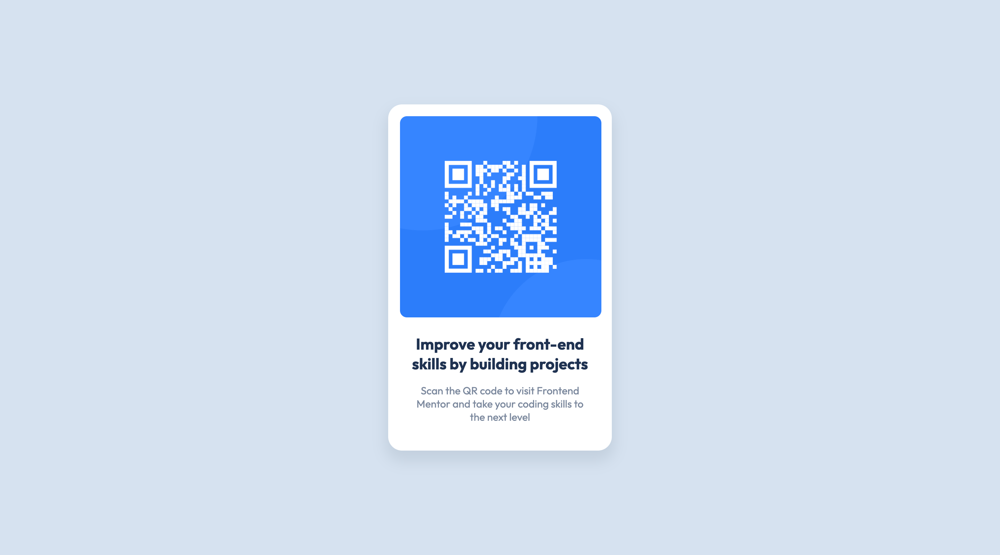

# Frontend Mentor - QR code component

This is a solution to the [QR code component challenge on Frontend Mentor](https://www.frontendmentor.io/challenges/qr-code-component-iux_sIO_H). Frontend Mentor challenges help you improve your coding skills by building realistic projects.

## Table of contents

- [Overview](#overview)
  - [The challenge](#the-challenge)
  - [Screenshot](#screenshot)
  - [Links](#links)
- [My process](#my-process)
  - [Built with](#built-with)
  - [What I learnt](#what-i-learnt)
  - [Useful resources](#useful-resources)
- [Author](#author)

## Overview

### The challenge

Users should be able to:

View the optimal layout depending on their device's screen size

### Screenshot



Above is what you should see when you click on the Live Site link below.

### Links

- Solution URL: [Solution](https://github.com/Max88-git/qr-code-component)
- Live Site URL: [Live Site](https://max88-git.github.io/qr-code-component/)

## My process

### Built with

- Semantic HTML5 markup
- CSS custom properties
- Flexbox
- Google Fonts

### What I learnt

To boost accessibility, I learned how to properly arrange my HTML elements utilising native HTML5 landmark elements. I also learned how to use Flexbox for the component container to centre objects in CSS. I also learned how to define variables and build custom attributes for the HSL colour scheme.

Here are some code snippets I am proud of:

```css
:root {
  /* Colors */
  --white: hsl(0, 0%, 100%);
  --light-gray: hsl(212, 45%, 89%);
  --grayish-blue: hsl(219, 15%, 55%);
  --dark-blue: hsl(218, 44%, 22%);
}

section {
  /* Center items not only horizontally but also vertically */
  display: flex;
  flex-direction: column;
  justify-content: center;
  align-items: center;
  width: 100%;
  height: 100vh;
}
```

### Useful resources

- [How to center in CSS with Flexbox](https://coryrylan.com/blog/how-to-center-in-css-with-flexbox) - This blog post proved to be quite beneficial in terms of learning about Flexbox. I was able to figure out how to centre the container by converting the parent into a flex container.
- [Creating Color Themes With Custom Properties](https://css-tricks.com/creating-color-themes-with-custom-properties-hsl-and-a-little-calc/) - This was helpful in figuring out how to make colour theme variables.

## Author

- Website - [Max Lockwood](https://www.maxlockwood.uk/)
- Frontend Mentor - [@Max88-git](https://www.frontendmentor.io/profile/Max88-git)
